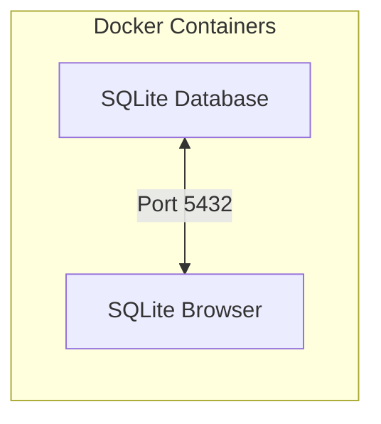

# Docker SQLite

> __⭐️ Local & automated environment for SQLite with a test database.__

This project uses [Docker](https://www.docker.com/) to create a local environment with SQLite
and a test database to run queries and learn about SQL.

## Architecture

The [docker-compose.yml](docker-compose.yml) file specifies how containers should be executed.

The following diagram shows the architecture:



## Prerequisites

* [Install Docker Desktop](https://www.docker.com/products/docker-desktop/)

## Steps to run the environment

Open a terminal in the project root folder.

### 1. Execute the docker containers

```bash
docker compose up
```

<details>
<summary>Some interesting Docker commands</summary>

| Commmand                                  | Description                                                                                                                            |
| ----------------------------------------- | -------------------------------------------------------------------------------------------------------------------------------------- |
| `docker stats`                            | Display a live stream of container(s) resource usage statistics. <br /> Useful to monitor Docker containers memory usage.              |
| `docker container ls --all`               | List all Docker containers (running or not). <br /> If both containers specify "Up" in the status column, everything is running fine.   |
| `docker logs <containerid>`               | Fetch the logs of a container. <br /> Really useful to see what's going on.                                                            |
| `docker top <containerid>`                | Display the running processes of a container                                                                                           |
| `docker exec -it <containerid> <command>` | Run a command in a running container (in interactive mode)                                                                             |
| `docker images`                           | List images                                                                                                                            |
| `docker version`                          | Show the Docker version information                                                                                                    |
| `docker info`                             | Display system-wide information                                                                                                        |

</details>

### (Optional) Remove and start containers to clean data

This is useful if you want to clean the data inside the containers.

```bash
docker compose rm --stop --force
docker compose up
```

### (Optional) Connect to one of the Docker containers

Obtain the name of the container you want to connect to:
```bash
docker container ls --all
```

> The name is the last column.

Execute the sh command in that container to connect to it:
```bash
docker exec -it <container-name> sh
```

## References

* [Docker](https://www.docker.com/)
* [Docker commands](https://docs.docker.com/engine/reference/commandline/docker/)
* [Docker Compose commands](https://docs.docker.com/compose/reference/)
