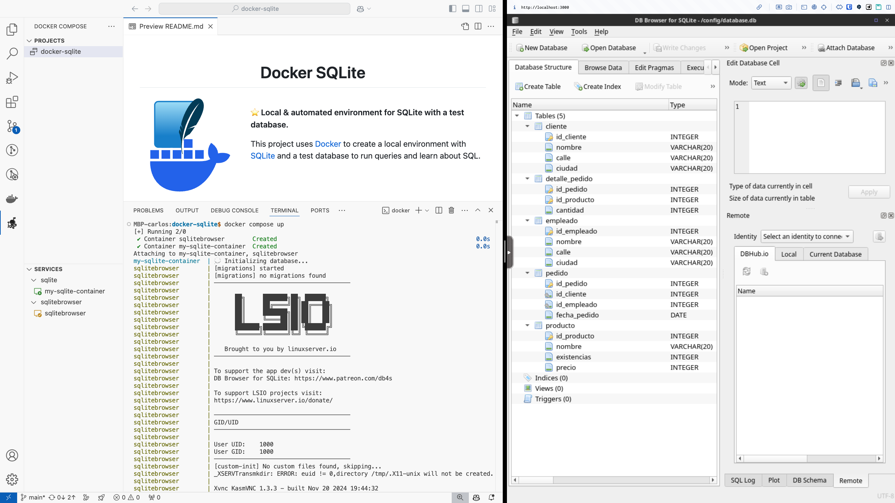
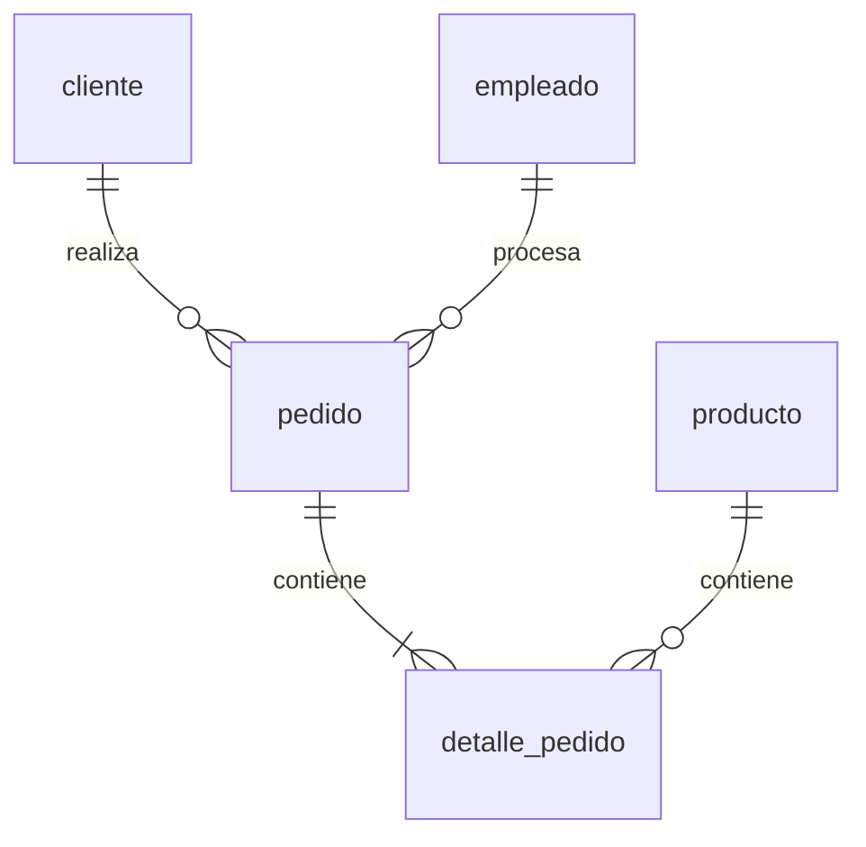
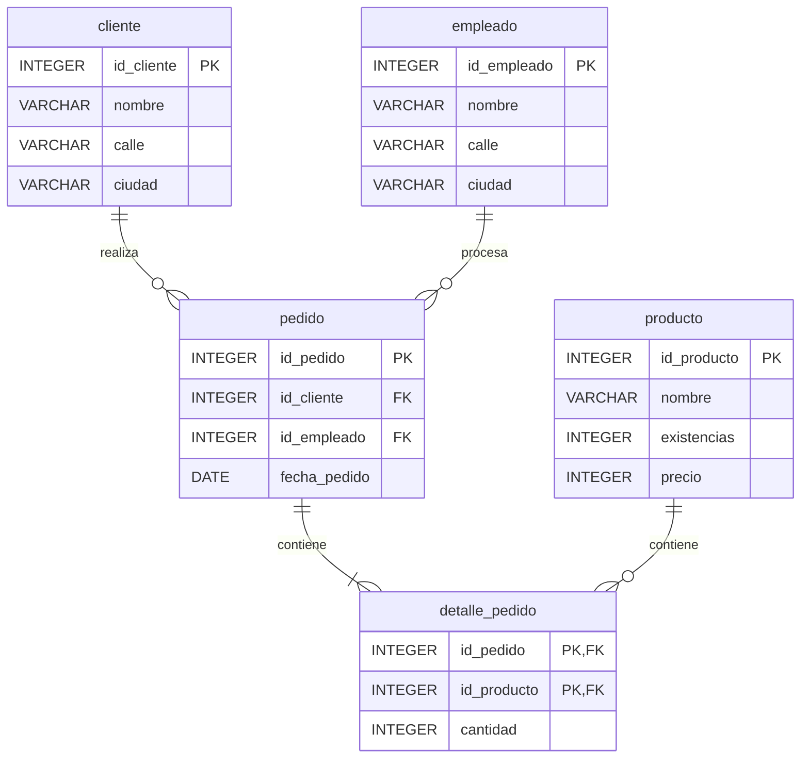
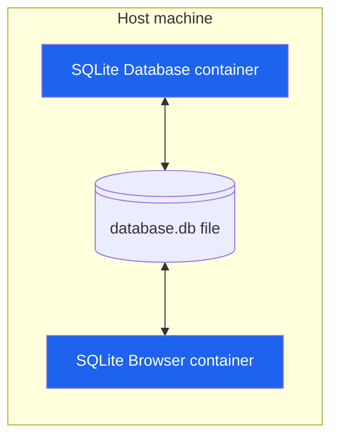

<h1 align="center">Docker SQLite</h1>

<a href="#"></a>

<br />

__⭐️ Local & automated environment for SQLite with a test database.__

This project uses [Docker](https://www.docker.com/) to create a local environment with [SQLite](https://www.sqlite.org/) and a test database to run queries and learn about SQL.

<br /><br /><br />

## Demo



## Entity relationship model

The following diagrams show the entity relationship model of the database.

### Simplified version



### Detailed version (with attributes)



Take a look at [Mermaid Entity Relationship Diagrams documentation](https://mermaid.js.org/syntax/entityRelationshipDiagram.html)
for more information about the syntax.

## Architecture

The [docker-compose.yml](docker-compose.yml) file specifies how containers should be executed.

The following diagram shows the architecture:



The `SQLite Database container` is used to run the SQLite database and the `SQLite Browser container`
is used to run a GUI to interact with the database.

The [./database/data/database.db](./database/data/database.db) file is used to store the database data in binary format.

The [./database](./database) folder of the repository is mounted to the `/database` folder in the `SQLite Database container`.
This makes initialization scripts available to the container and allows the database data to persist even if the container is removed.

The [./database/data](./database/data) folder of the repository is mounted to the `/config` folder in the `SQLite Browser container`.
This makes the database data file available to the `SQLite Browser container` so that it can be opened in the GUI.
`/config` is the user home directory in the container, so it's the folder that is opened by default in the GUI, making it easy to open the database.

With this approach, __the database data is stored in the host machine and can be accessed by both containers__.
There is no need to establish a network connection between the containers.

## Prerequisites

* [Install Docker Desktop](https://www.docker.com/products/docker-desktop/)

## Steps to run the environment

Open a terminal in the project root folder.

### 1. Execute the docker containers

```bash
docker compose up
```

<details>
<summary>Some interesting Docker commands</summary>

| Commmand                                  | Description                                                                                                                            |
| ----------------------------------------- | -------------------------------------------------------------------------------------------------------------------------------------- |
| `docker stats`                            | Display a live stream of container(s) resource usage statistics. <br /> Useful to monitor Docker containers memory usage.              |
| `docker container ls --all`               | List all Docker containers (running or not). <br /> If both containers specify "Up" in the status column, everything is running fine.   |
| `docker logs <containerid>`               | Fetch the logs of a container. <br /> Really useful to see what's going on.                                                            |
| `docker top <containerid>`                | Display the running processes of a container                                                                                           |
| `docker exec -it <containerid> <command>` | Run a command in a running container (in interactive mode)                                                                             |
| `docker images`                           | List images                                                                                                                            |
| `docker version`                          | Show the Docker version information                                                                                                    |
| `docker info`                             | Display system-wide information                                                                                                        |

</details>

### 2. Open the SQLite Browser and connect to the database

Open a web browser and go to [http://localhost:3000](http://localhost:3000).

To open the database, click on the `Open Database` button, select the `database.db` file and click `Open`.

__🚀 Now you can inspect the database and run queries.__

### 3. Stop the containers

After executing the command `docker compose up`, the containers will be running and the terminal will be blocked.

To stop the containers, just press `Ctrl + C` in the terminal.

If you want to start them again, just go back to step 1.

### (Optional) Connect to one of the Docker containers

If you want to connect to one of the Docker containers, you have to open a new terminal window,
because the current terminal is blocked by the containers.

Obtain the name of the container you want to connect to:
```bash
docker container ls --all
```

> The name is the last column.

Execute the sh command in that container to connect to it:
```bash
docker exec -it <container-name> sh
```

To exit a container just press `Ctrl + D`.

## References

* [Docker](https://www.docker.com/)
* [Docker commands](https://docs.docker.com/engine/reference/commandline/docker/)
* [Docker Compose commands](https://docs.docker.com/compose/reference/)
